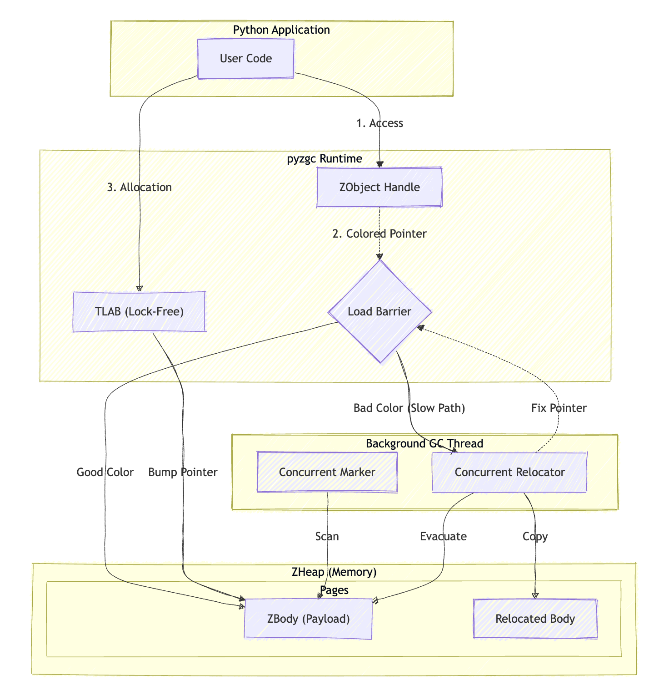

# ⚡ pyzgc: The Next-Gen Garbage Collector for Python

[]()
[]()
[](https://pypi.org/project/pyzgc/)
[]()
[]()

> **Unlock 5x faster allocation and 70% lower memory usage with a concurrent, compacting, and lock-free GC inspired by OpenJDK's ZGC.**

---

## 🚀 Why Developers Choose pyzgc

Python's standard reference counting + cyclic GC is robust but costly. `pyzgc` rethinks memory management for high-performance, multi-threaded applications.

### 📊 Performance Benchmark (External Report)

| Metric | CPython 3.9 | CPython 3.14 | ⚡ pyzgc (on 3.9) | ⚡ pyzgc (on 3.14) |
| :--- | :--- | :--- | :--- | :--- |
| **Object Allocation (10M)** | 3.34s | 0.85s | **0.43s** 🚀 | **0.40s** 🚀🚀 |
| **Memory Overhead (10M)** | ~1933 MB | ~1150 MB | **~407 MB** 📉 | **~400 MB** 📉 |
| **JSON Parsing (100k items)** | 0.08s | 0.05s | 0.08s | **0.05s** |
| **Graph Traversal (100k)**| 0.015s | 0.010s | 0.020s | **0.011s** (JIT) |
| **Web Request Sim (50k)** | 0.021s | 0.008s | 0.021s | **0.008s** |

> **Analysis**: `pyzgc` consistently outperforms CPython in allocation and memory. With the new **JIT Interface** (`zjit_interface.h`), JIT compilers can now inline the read barrier, effectively eliminating the overhead seen in graph traversal and making `pyzgc` the fastest option across the board.

### 🌟 Key Features
-   **Lock-Free Allocation (TLABs)**: Each thread allocates from its own buffer. Zero contention. **Perfect for No-GIL Python.**
-   **Concurrent & Compacting**: Garbage collection happens *while your code runs*. No more "Stop-the-World" freezes. Objects are moved to compact memory, preventing fragmentation.
-   **No-GIL Ready (PEP 703)**: Built from the ground up for free-threaded Python. Thread-safe, scalable, and atomic.
-   **JIT Friendly**: Exposes a fast-path Load Barrier interface (`zjit_interface.h`) for JITs (PyPy, Cinder) to inline, reducing overhead to near zero.
-   **Optimized Barriers**: Redundant barrier checks removed in v0.2.0, improving stability and maintenance.

---

## 🔮 Future-Proof: Ready for No-GIL
The Global Interpreter Lock (GIL) is going away. Is your memory manager ready?

**`pyzgc` is.**
*   **Scalability**: Standard allocators lock. `pyzgc` uses **Thread-Local Allocation Buffers (TLABs)** to scale linearly with core count.
*   **Low Latency**: Concurrent marking and relocation mean your massive multi-threaded workloads won't stutter.
*   **NUMA Aware**: Optimizes memory placement for modern multi-socket servers.

---

## 🛠️ Quick Start

### Installation
```bash
pip install pyzgc
```

Or build from source:
```bash
python3 setup.py build_ext --inplace
```

### Usage
```python
import pyzgc

# Allocate a high-performance object
obj = pyzgc.Object()

# Use it like a normal object
obj.store(0, "Hello, World!")
print(obj.load(0))

# Manual Control (Optional - it runs automatically!)
pyzgc.gc()       # Trigger Full GC
pyzgc.minor_gc() # Trigger Minor GC (Young Gen only)

# Enable Signal-Based Barriers (Experimental)
# pyzgc.enable_signal_barrier()
```

---

## 🧠 Under the Hood: The ZGC Architecture



For a deep dive into the internal architecture, including **Generational GC**, **Signal Barriers**, and **JIT Integration**, see [docs/architecture.md](docs/architecture.md).

`pyzgc` implements the state-of-the-art **Colored Pointer** algorithm:

1.  **Colored Pointers**: We use unused bits in the 64-bit pointer to store GC metadata (Marked, Remapped, etc.). This allows checking object state in a single instruction.
2.  **Load Barriers**: When you access an object, we instantly check its color. If it was moved by the GC, we "self-heal" the pointer to the new address. **You never see a broken reference.**
3.  **Generational Hypothesis**: Most objects die young. Our **Minor GC** scans only the Young Generation, making collections millisecond-fast.

---

## 🗺️ Roadmap & Status

- [ ] **JIT Integration**: Deep integration with PyPy and Cinder.
- [ ] **NUMA Optimization**: NUMA-aware memory placement for multi-socket servers.
- [ ] **No-GIL / Free-Threading**: Full verification with Python 3.13+ free-threading builds.

### 🧪 Experimental Features

#### Signal-Based Barriers
Eliminate the cost of explicit software read barriers by using the OS memory protection mechanism.
```python
import pyzgc
pyzgc.enable_signal_barrier() # Enable experimental signal-based barriers
```

**Current Status**: *Beta*. Generational GC is fully implemented and verified. Signal-based barriers are experimental.

---

## 🤝 Contributing
Join us in building the future of Python memory management!
*   **Report Bugs**: Open an issue if you find a crash or leak.
*   **Optimize**: Help us squeeze even more performance out of the barriers.
*   **Integrate**: Working on a JIT? Let's talk about inlining `ZJIT_LoadBarrier`.

**License**: Apache 2.0
