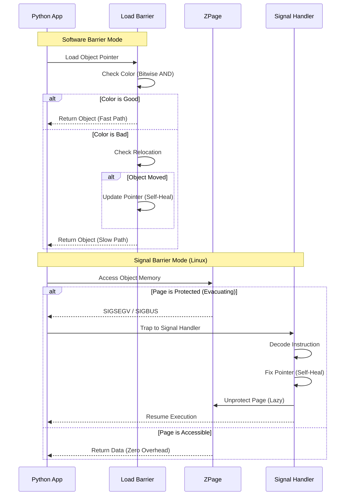

# pyzgc Architecture

`pyzgc` is a high-performance, concurrent, compacting garbage collector for Python, inspired by OpenJDK's ZGC. It is designed to minimize pause times and maximize throughput for multi-threaded applications, making it ideal for the upcoming No-GIL Python era.

## High-Level Architecture

```mermaid
graph TD
    subgraph Python Application
        Mutator[Mutator Threads]
        Alloc[Allocation (TLAB)]
        Read[Object Access (Load Barrier)]
    end

    subgraph ZGC Runtime
        GCThread[Background GC Thread]
        Mark[Mark Phase]
        Relocate[Relocate Phase]
    end

    subgraph Heap Memory
        Young[Young Generation]
        Old[Old Generation]
    end

    Mutator -->|Allocates| Alloc
    Alloc -->|New Objects| Young
    Read -->|Triggers| Barrier{Barrier Check}
    
    GCThread -->|Scans| Mark
    GCThread -->|Evacuates| Relocate
    
    Mark -->|Marks Live| Young
    Mark -->|Marks Live| Old
    
    Relocate -->|Promotes| Young
    Relocate -->|Compacts| Old
    Young -->|Promotion| Old
```

## Low-Level: Load Barrier Mechanism



## 1. Core Concepts

### 1.1 Colored Pointers
`pyzgc` uses **Colored Pointers** to store GC metadata directly in the object reference. On 64-bit systems, we use the upper bits of the pointer to indicate the state of the object.

```
+-------------------+----------------+----------------+----------------+
|      Unused       |    Metadata    |      ...       | Object Address |
+-------------------+----------------+----------------+----------------+
|       16 bits     |     4 bits     |      ...       |     44 bits    |
+-------------------+----------------+----------------+----------------+
```

- **Marked0 / Marked1**: Indicates the object is marked live in the current cycle.
- **Remapped**: Indicates the reference points to the current object location (stable).
- **Finalizable**: (Reserved for future use).

### 1.2 Load Barriers
A **Load Barrier** is a small piece of code injected at every object access (read). It checks the pointer's color.
- **Good Color**: If the pointer color matches the current global "Good Color", access proceeds immediately.
- **Bad Color**: If mismatch, the "Slow Path" is taken:
    1.  Check if object was relocated.
    2.  If yes, update the pointer to the new address (**Self-Healing**).
    3.  If no, just fix the color.

#### Barrier Modes
1.  **Software Barrier (Default on macOS)**: Explicit bitwise check in C code.
    ```c
    if (!Z_HAS_COLOR(ptr, good_color)) { fix(ptr); }
    ```
2.  **Signal-Based Barrier (Default on Linux)**: Uses OS memory protection (`mprotect`).
    - Pages being evacuated are marked `PROT_NONE`.
    - Access triggers `SIGSEGV`.
    - Signal handler fixes the pointer and resumes execution.
    - **Benefit**: Zero overhead for the happy path (no branches).

## 2. Memory Management

### 2.1 ZHeap & ZPages
The heap is divided into **ZPages**:
- **Small Pages**: For small objects.
- **Medium Pages**: For medium objects.
- **Large Pages**: For large objects (contiguous).

### 2.2 TLABs (Thread-Local Allocation Buffers)
To avoid lock contention, each thread allocates from its own **TLAB**.
- **Fast Path**: Bump-pointer allocation in TLAB (Atomic-free).
- **Slow Path**: Request new TLAB from global heap (Locked).

## 3. Generational GC

`pyzgc` implements a **Generational** hypothesis: "Most objects die young."

### 3.1 Generations
- **Young Generation**: New objects are allocated here. Collected frequently (Minor GC).
- **Old Generation**: Objects that survive a collection are promoted here. Collected rarely (Full GC).

### 3.2 Remembered Set (RemSet)
To collect the Young Gen without scanning the Old Gen, we track pointers from Old-to-Young in a **Remembered Set**.
- **Write Barrier**: When storing a pointer, if `Old -> Young`, add the Old object to the RemSet.

### 3.3 GC Cycles
- **Minor GC**:
    1.  **Mark**: Scan Roots + RemSet. Mark live Young objects.
    2.  **Relocate**: Move live Young objects to Old Gen (Promotion).
- **Full GC**:
    1.  **Mark**: Scan Roots. Mark all live objects.
    2.  **Relocate**: Compact entire heap.

## 4. Concurrency

The GC runs in a background thread (`pthread`), concurrent with the Python application.

- **Phase 1: Mark**: Concurrent marking of the object graph.
- **Phase 2: Relocate**: Concurrent evacuation of pages.
- **Handshakes**: Short pauses (Stop-The-World) are only needed for:
    - Root Scanning (Stack scanning).
    - Phase transitions (flipping the Good Color).

## 5. JIT Integration

`pyzgc` exposes a passive interface for JIT compilers (like PyPy, Cinder, or Python 3.13+ JIT).

- **`zjit_interface.h`**: Defines `ZJIT_Context`.
- **Exposed Data**:
    - `good_color_ptr`: Address of the global good color variable.
    - `mask_*`: Bitmasks for colors.
    - `fix_pointer_func`: Address of the slow path function.
- **Usage**: JITs can inline the check:
    ```assembly
    MOV R1, [Obj]       ; Load pointer
    AND R1, Mask        ; Check color
    CMP R1, GoodColor
    JNE SlowPath        ; Jump to fix if bad
    ```
